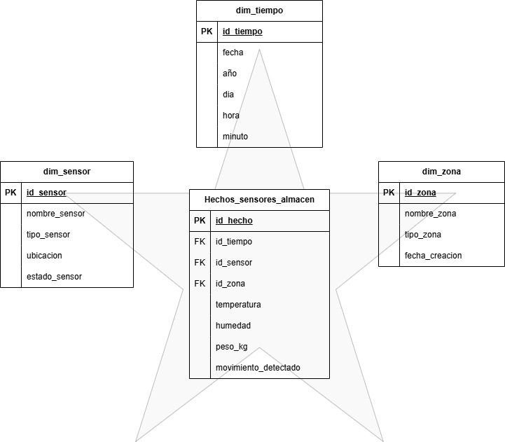

# Gestión de Almacenes Industriales con IoT

## Equipo de Desarrollo
- **Willian Chapid**
- **Carlos Camacho**
- **Luis Martinez**

## Descripción del Proyecto

Este proyecto simula una solución IoT para la gestión inteligente de almacenes industriales, enfocándose en mejorar la eficiencia operacional, la seguridad y el control de inventario mediante supervisión en tiempo real y automatización de procesos.

## Sector de Aplicación

**Gestión de Almacenes Industriales** - Un componente esencial en la cadena de suministro donde la implementación de tecnologías IoT permite:
- Supervisión en tiempo real
- Optimización de procesos
- Reducción de errores humanos
- Control automatizado de inventario

## Sensores Simulados

### 1. Sensor de Temperatura y Humedad

**Milesight EM300-TH**

| Especificación | Valor |
|----------------|--------|
| **Conectividad** | LoRaWAN |
| **Rango Temperatura** | -30°C a +70°C (±0.3°C) |
| **Rango Humedad** | 0% a 100% RH (±3%) |
| **Clasificación** | IP67 (resistente al polvo y agua) |
| **Duración Batería** | Hasta 10 años |
| **Alcance** | 15 km (rural) / 2 km (urbano) |

**Caso de Uso Real:** Hospital de la Ciudad de Etlik, Turquía - Monitoreo de refrigeradores y áreas de almacenamiento en frío para medicamentos y muestras biológicas.

### 2. Sensor de Movimiento

**TP-Link Tapo T100**

| Especificación | Valor |
|----------------|--------|
| **Tipo** | PIR (Infrarrojo Pasivo) |
| **Conectividad** | Wi-Fi (requiere hub Tapo) |
| **Ángulo Detección** | 120° |
| **Rango Detección** | Hasta 7 metros (ajustable: 3m/5m/7m) |
| **Batería** | CR2450 (duración: 2 años) |

**Caso de Uso Real:** Monitoreo de áreas específicas del almacén para detectar movimientos no autorizados y automatizar sistemas de iluminación y seguridad.

### 3. Sensor de Peso

**Celda de Carga CZL601 + Módulo HX711**

| Especificación | Valor |
|----------------|--------|
| **Capacidad** | 5 kg a 50 kg |
| **Convertidor** | HX711 (24 bits) |
| **Material** | Aleación de aluminio anodizado |
| **Precisión** | C2/C3 |
| **Voltaje** | 9-12V DC |
| **Clasificación** | IP65 |

**Caso de Uso Real:** Sistemas de pesaje de pallets para verificar cargas antes del envío, previniendo errores logísticos.

## Arquitectura MQTT

### Estructura de Topics

```
almacen/{zona}/{dispositivo}/{tipoDato}
```

### Ejemplos de Topics y Payloads

| Sensor | Topic MQTT | Payload Ejemplo |
|--------|------------|-----------------|
| **Temperatura/Humedad** | `almacen/zona1/tempHumSensor01/lectura` | ```json{"temperature": 24.8,   "humidity": 60.5,   "timestamp": "2025-06-03T10:30:00Z" }``` |
| **Movimiento** | `almacen/estanteria3/movSensor01/evento` | ```json{   "motion_detected": true,   "timestamp": "2025-06-03T10:30:00Z" }``` |
| **Peso** | `almacen/recepcion/weightSensor01/lectura` | ```json{   "value": 48.5,   "unit": "kg",   "timestamp": "2025-06-03T10:30:00Z" }``` |

## Justificación de la Selección

### Sensor de Temperatura y Humedad
- **Propósito:** Garantizar condiciones ambientales óptimas
- **Beneficio:** Conservación adecuada de productos sensibles
- **Impacto:** Reducción de pérdidas por deterioro

### Sensor de Movimiento  
- **Propósito:** Mejorar seguridad y eficiencia energética
- **Beneficio:** Detección de movimientos no autorizados y automatización
- **Impacto:** Mayor seguridad y ahorro energético

### Sensor de Peso
- **Propósito:** Control preciso de cargas en pallets
- **Beneficio:** Verificación automática de pesos establecidos
- **Impacto:** Prevención de errores logísticos y mejor gestión de inventario

## Sistema Estrella


## Casos de Uso Implementados

1. **Control Ambiental:** Monitoreo continuo de temperatura y humedad
2. **Seguridad Perimetral:** Detección automática de movimientos
3. **Gestión de Cargas:** Verificación de pesos en tiempo real
4. **Automatización:** Respuesta automática a eventos detectados

---

**Desarrollado como parte del proyecto final de IoT aplicado a la gestión industrial**